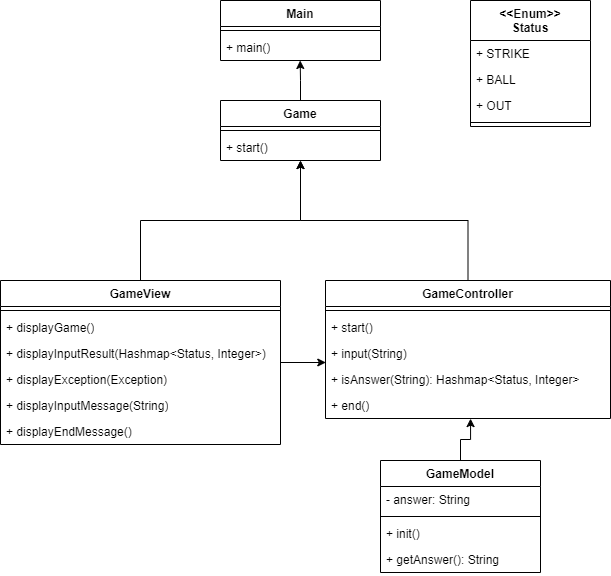
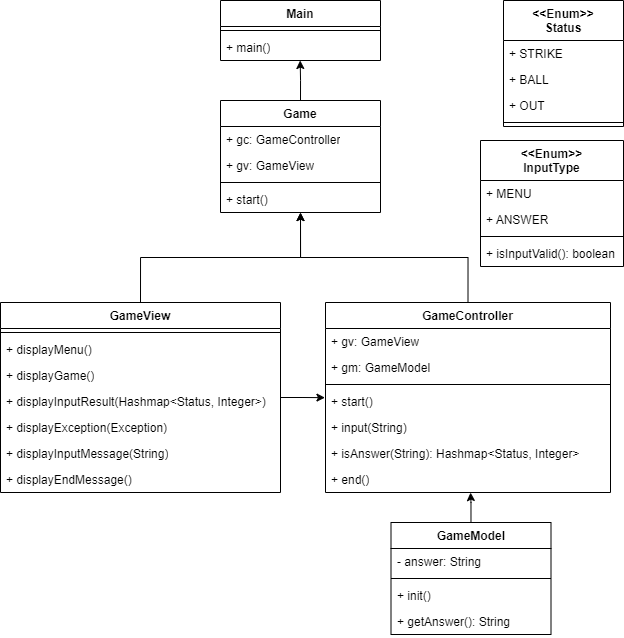
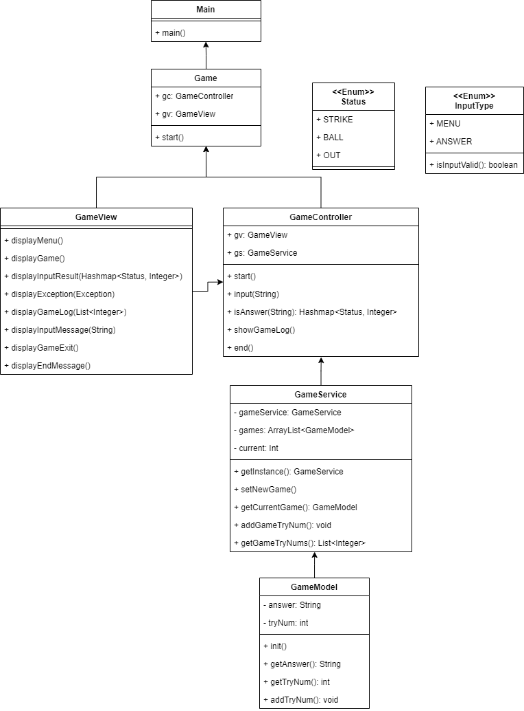
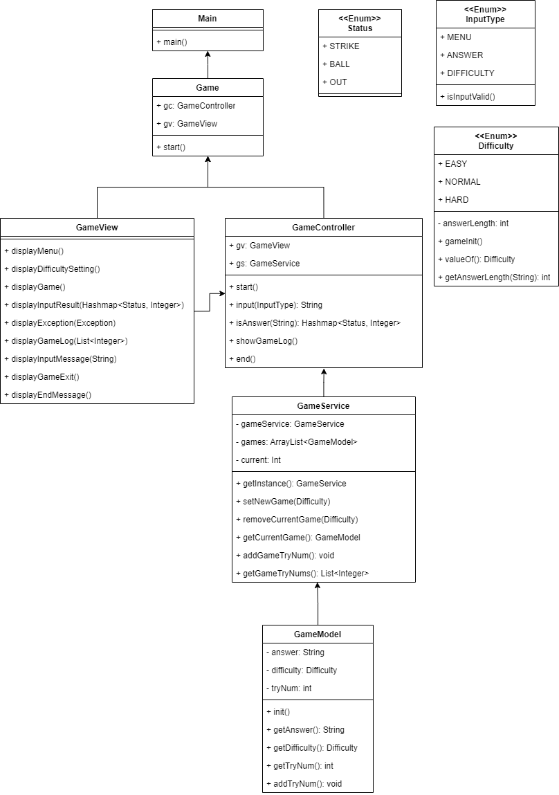

# 계산기 만들기
feat.내일배움캠프

---

#### Lv 1. 기본 게임 구현 (필수)
- 요구사항 정의
  - [x] 정답 숫자 생성하기
      - [x] 각 자리는 1~9사이의 숫자
      - [x] 동일한 숫자는 사용 x
  - [x] 정답을 맞추기 위한 숫자를 입력
      - [x] 서로 다른 세자리 수 입력 가능
      - [x] 동일한 숫자는 사용 x
      - [x] 숫자만 입력 가능(문자 작성 x)
  - [x] 결과값 출력 및 게임 로직 적용
      - [x] 정답과 입력 값을 비교 후 "볼, 스트라이크, 아웃"으로 표시
        - [x] 스트라이크 : 입력값과 정답을 비교해 같은 자리에 같은 숫자가 있는 경우
        - [x] 볼 : 숫자는 같지만, 자리는 다른 경우
        - [x] 아웃 : 숫자와 자리 모두 다른 경우
      - [x] 입력한 세자리 숫자가 정답과 같은경우, 게임 종료
        - [x] '3 스트라이크'면 정답
      - [x] 올바르지 않은 입력 값에 대해 오류 문구 출력
- 설계
  - 클래스 다이어그램

    
  - 기능 분해

    | 기능명       | 설명                                    | 예외                             |
    |-----------|:--------------------------------------|:-------------------------------|
    | 숫자 랜덤 생성  | 3자리 숫자를 무작위로 생성하는 기능                  |  |
    | 답 입력      | 플레이어의 답을 입력 받는 기능                     |  같은 숫자를 입력한 경우<br/> 문자를 입력한 경우                              |
    | 결과값 비교    | 정답과 입력 값 비교 후 '볼, 스트라이크, 아웃'을 반환하는 기능 |                                |
    | 정답 메시지 표시 | 정답인 경우 축하 메시지를 표시하는 기능                |                                |

#### Lv 2. 입력 및 출력 개선 (필수)
- 요구사항 정의
  - [ ] 입력값이 유효한지 검사
    - [ ]  3자리 수인지 자릿수를 검사
    - [ ]  중복된 숫자가 없는지 중복 숫자를 검사
    - [ ]  입력값에 숫자만 포함되어 있는지 검사
    - [ ]  유효하지 않은 값인 경우 “올바르지 않은 입력값입니다.” 출력
  - [ ] 출력 개선
    - [ ]  프로그램을 시작할 때 안내문구를 보여주세요.
    - [ ]  1을 입력하면 아래와 같이 게임 진행
        ```
        환영합니다! 원하시는 번호를 입력해주세요
        1. 게임 시작하기 2. 게임 기록 보기 3. 종료하기
        1 // 사용자 입력
              
        < 게임을 시작합니다 >
        숫자를 입력하세요.
        .
        .
        ```
    - [ ]  “2. 게임 기록 보기”는 Lv3에서 제시 (2는 입력 x)
    - [ ]  3을 입력하면 게임 종료
    - [ ] 정답을 맞힌 경우, 반복

- 설계
  - 클래스 다이어그램

    

  - 기능 분해

    | 기능명       | 설명                                         | 예외                   |
    |-----------|:-------------------------------------------|:---------------------|
    | 입력값 유효성 검사 | 입력 받은 값이 유효한 값인지 검사 후 boolean 타입으로 반환하는 기능 |                      |
    | 게임 메뉴 출력  | 게임 메뉴를 출력하는 기능                             |                      |
    | 게임 종료     | 프로그램을 종료하는 기능                              |                      |

#### Lv 3. 추가 기능 및 개선 (도전)
- 요구사항 정의
  - [ ] 게임 기록 통계
    - [ ] 지금 시도하는 게임이 몇 번째 게임인지 기록
    - [ ] 사용자가 정답을 맞힐 때까지의 “시도 횟수”를 기록하고 게임이 끝났을 때, 총 시도 횟수를 출력
    - [ ] 프로그램 시작 및 정답을 맞히는 경우, lv1과 같은 안내 문구 출력, 2를 입력하면 게임의 시도 횟수 출력
      ```
      환영합니다! 원하시는 번호를 입력해주세요
      1. 게임 시작하기  2. 게임 기록 보기  3. 종료하기
         2 // 2번 게임 기록 보기 입력

      < 게임 기록 보기 >
      1번째 게임 : 시도 횟수 - 14
      2번째 게임 : 시도 횟수 - 9
      3번째 게임 : 시도 횟수 - 12
      .
      .
      ``` 
  - [ ] 출력 개선
    - [ ]  실행 및 정답을 맞힌 경우, 표시되는 안내문구 선택지 개선
        - [ ]  3을 입력하면 게임 종료
        - [ ]  이전의 게임 기록 초기화
    - [ ] 1, 2, 3 이외의 입력값에 대해서는 오류 메시지 출력

- 설계
  - 클래스 다이어그램

    

    - 기능 분해

      | 기능명      | 설명                         | 예외             |
      |----------|:---------------------------|:---------------|
      | 게임 메뉴 입력 | 게임 메뉴의 선택지를 입력받는 기능        | 1, 2, 3 이외의 입력 |
      | 게임 기록 보기 | 현재까지의 게임 횟수와 시도횟수를 출력하는 기능 |                |
      | 게임 기록 저장 | 현재까지의 게임 횟수와 시도횟수 저장       |

#### Lv 4. 추가 기능 및 개선 (도전)
- 요구사항 정의
  - [ ] 게임 난이도 조절
    - [ ] 사용자로부터 난이도를 입력받고, 그에 따라 숫자의 자릿수 조정 가능
    - [ ] 자릿수는 3,4,5 중 1택
      - [ ] 이외의 값은 예외 처리
    - [ ] 자릿수를 입력하면 자동으로 게임 실행

- 설계
    - 클래스 다이어그램

      

    - 기능 분해

      | 기능명       | 설명                        | 예외           |
      |-----------|:--------------------------|:-------------|
      | 게임 난이도 조절 | 난이도를 입력받고 정답의 자릿수 조정하는 기능 | 3,4,5 이외의 입력 |
